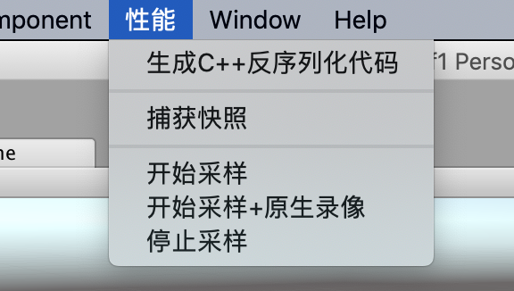
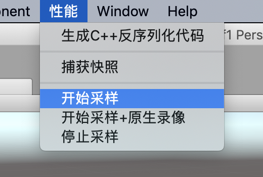
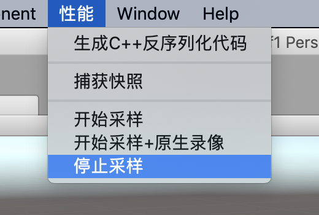

*Unity*是个普及度很高拥有大量开发者的游戏开发引擎，其提供的*Unity*编辑器可以快速的开发移动设备游戏，并且通过编辑器扩展可以很容易开发出项目需要的辅助工具，但是*Unity*提供性能调试工具非常简陋，功能简单并且难以使用，如果项目出现性能问题，定位起来相当花时间，并且准确率很低，一定程度上靠运气。

> Profiler

目前Unity随包提供的只有*Profiler*工具，里面聚合*CPU*、*GPU*、内存、音频、视频、物理、网络等多个维度的性能数据，但是我们大部分情况下只是用它来定位卡顿问题，也就是主要*CPU*时间消耗(图\ref{profiler})。


在*CPU*的维度里面，可以看到当前渲染帧的函数调用层级关系，以及每个函数的时间开销以及调用次数等信息，但是这个工具同一时间只能处理**300**帧左右的数据，如果游戏帧率30，那么只能看到过去**10**秒的信息，并且需要我们一直盯着图表看才有机会发现意外的丢帧情况，这种设计非常的不友好，违反正常人的操作习惯，因为通常情况下如果我要调试游戏内战斗过程的性能开销，首先我要像普通玩家那样安安静静的玩一把，而不是分散出大部分精力去看一个只有10秒历史的滚动图表。这种交互带来两个明显的问题，

- 由于分心去看*Profiler*，导致不能全心投入游戏，从而不能收集正常战斗过程的性能数据
- 为了收集数据需要像正常玩家那样打游戏，不能全神关注*Profiler*图表，从而不能发现/查看所有的性能问题

上面两个情形相互排斥，鱼与熊掌不可兼得。从这个角度来看，*Profiler*不是一个好的性能调试工具，苛刻的操作条件导致我们很难发现性能问题，想要通过*Profiler*定位所有的性能问题简直是痴人说梦。

> MemoryProfiler

Unity还提供另外一个内存分析工具MemoryProfiler(图\ref{mp})


在这个界面的左边彩色区域里，*MemoryProfiler*按类型占用总内存大小绘制对应面积比例的矩阵图，第一次看到还是蛮酷炫的，*Unity*是想通过这个矩阵图向开发者提供对象内存检索入口，但是实际使用过程中问题多多。

1. 内存分析过程缓慢
2. 在众多无差别的小方格里面找到实际关心的资源很难，虽然可以放大缩小，但感觉并没有提升检索的便利性
3. 每个对象只提供父级引用关系，无法看到完整的对象引用链，容易在跳转过程中搞错上下文关系
4. 引擎对象的引用和*il2cpp*对象的引用混为一谈，让使用者对引用关系的理解模糊不清
5. 没有按引擎对象内存和*il2cpp*对象内存分类区别统计，加深使用者对内存使用的误解

*MemoryProfiler*[源码](https://bitbucket.org/Unity-Technologies/memoryprofiler)托管在*Bitbucket*，但是从最后提交记录来看，这个内存工具已经超过**2**年半没有任何更新了，但是这期间*Unity*可是发布了好多个版本，想想就有点后怕。
\
\

有热心开发者也忍受不了*Unity*这缓慢的更新节奏，干脆自己动手基于源码在[*github*](https://github.com/GameBuildingBlocks/PerfAssist)上建代码仓库进行二次开发。
\
\

*PerfAssist*在*MemoryProfiler*源码的基础上做了比较大的更新，主要是增加检索的便利性以及内存快照对比，使用起来比*MemoryProfiler*初代产品方便了不少，但是由于交互界面的限制，也无法完整展示内存引用关系，内存分析过程依然异常缓慢，甚至会在分析过程中异常崩溃。
\
{width=80%}
\

鉴于*Unity*性能调试工具现实存在问题，我觉得亟待开发面向开发者、提供更多维度、更高效率的性能调试工具，于是我开发了UnityProfiler和MemoryCrawler两款工具，分别替代*Profiler*以及*MemoryProfiler*进行相同领域的性能调试，它们均使用纯*C++*实现，因为经过与*C#*、*Python*语言的测试对比后发现*C++*有绝对的计算优势，可以非常明显提升性能数据分析效率和稳定性。这两款工具的定位是：降低*Unity*游戏性能调试的门槛，让拥有不同开发经验的开发者都可以轻松定位各种性能问题，尽管都没有可视化交互界面，不过并不影响分析结果的查看，它们都内置命令行模式的交互方式，并提供了丰富的命令，可以对性能数据做全方位的分析定位。


\pagebreak
# 快速开始

## 源码编译

1. 从*github*[下载源码](https://github.com/larryhou/MemoryProfiler)，并使用*Xcode*打开。
2. 从*Scheme*列表选择UnityProfiler，然后按快捷键*Comamnd+B*编译，该操作会生成命令行工具*/usr/local/bin/UnityProfiler*。
3. 从*Scheme*列表选择MemoryCrawler，然后按快捷键*Command+B*编译，该操作会生成命令行工具*/usr/local/bin/MemoryCrawler*。

## UnityProfiler

1. 集成*UnityEditor*脚本，生成数据捕获菜单。
把*Editor*目录放到*Unity*工程里面并刷新，之后在*UnityEditor*菜单里面会出现下图所示的菜单。
\

\

2. 按照[官方文档](https://docs.unity3d.com/Manual/ProfilerWindow.html)配置真机调试或在*Editor*环境调试。\

3. 启动游戏，在需要性能调试的逻辑开始前点击菜单*性能/开始采样*，并在逻辑结束后点击菜单*性能/停止采样*。
\
\ 
\

4. 启动UnityProfiler分析性能数据。\
在步骤3生成的性能数据保存在工程根目录的*ProfilerCapture*文件夹里面，执行如下命令开始性能调试会话。\

\footnotesize
```C#
$ UnityProfiler ProfilerCapture/20190514115025_PERF.pfc 
argc=2
argv[0]=UnityProfiler
argv[1]=ProfilerCapture/20190514115025_PERF.pfc
[0] RecordCrawler::load=28816729
    [1] RecordCrawler::loadStrings=648335
        [2] seek=338165
        [3] read=307367
    [4] RecordCrawler::crawl=27087144
/> func
38.17%    185.12ms #20      ██████████████████████████████████████ WaitForTargetFPS *1
 4.40%     21.36ms #20      ████ Profiler.CollectMemoryAllocationStats *128
 4.38%     21.25ms #200     ████ RenderForward.RenderLoopJob *7
 4.34%     21.02ms #1206    ████ WaitForJobGroup *27
 2.75%     13.32ms #100     ███ SceneCulling *25
 2.03%      9.85ms #100     ██ Camera.Render *3
 1.88%      9.12ms #100     ██ CullResults.CreateSharedRendererScene *46
 1.53%      7.42ms #100     ██ Render.TransparentGeometry *5
 1.52%      7.35ms #320     ██ SkinnedMeshFinalizeUpdate *38
 1.49%      7.21ms #20      █ BehaviourUpdate *76
 /> alloc
[FRAME] index=1036 time=4.250ms fps=235.3 alloc=113 offset=1474
[FRAME] index=1037 time=3.780ms fps=264.2 alloc=113 offset=2683
[FRAME] index=1038 time=4.100ms fps=243.4 alloc=113 offset=3916
[FRAME] index=1039 time=4.030ms fps=248.0 alloc=113 offset=8149
[FRAME] index=1040 time=3.860ms fps=258.7 alloc=113 offset=9358
[FRAME] index=1041 time=31.730ms fps=31.5 alloc=83215 offset=10567
/> frame 1036
[FRAME] index=1036 time=4.250ms fps=235.3 alloc=113 offset=1474
├─Profiler.CollectGlobalStats time=9.527%/0.405ms self=16.080%/0.065ms calls=1 *1
│  ├─Profiler.CollectMemoryAllocationStats time=75.144%/0.304ms self=100.000%/0.304ms calls=1 *2
│  ├─Profiler.CollectAudioStats time=7.752%/0.031ms self=6.700%/0.002ms calls=1 *3
│  │  └─AudioProfiler.CaptureFrame time=93.300%/0.029ms self=84.694%/0.025ms calls=1 *4
│  │     └─AudioProfiler.CaptureChannelGroup time=15.306%/0.004ms self=55.288%/0.002ms calls=1 *5
│  │        └─AudioProfiler.CaptureChannelGroup time=44.712%/0.002ms self=66.866%/0.001ms calls=2 *5
│  │           └─AudioProfiler.CaptureChannelGroup time=33.134%/0.001ms self=100.000%/0.001ms calls=2 *5
│  └─Profiler.CollectDrawStats time=1.025%/0.004ms self=100.000%/0.004ms calls=1 *6
├─EditorApplication.Internal_CallUpdateFunctions() time=0.748%/0.032ms self=99.069%/0.032ms calls=1 alloc=96 *7
│  └─GC.Alloc time=0.930%/0.000ms self=100.000%/0.000ms calls=3 alloc=96 *8
├─UpdateSceneIfNeeded time=0.556%/0.024ms self=9.870%/0.002ms calls=1 *9
│  ├─AudioManager.Update time=87.102%/0.021ms self=77.239%/0.016ms calls=1 *10
│  │  └─AudioSettings.InvokeOnAudioManagerUpdate() time=22.761%/0.005ms self=100.000%/0.005ms calls=1 *11
│  └─FlushDirty time=3.028%/0.001ms self=100.000%/0.001ms calls=1 *12
├─EditorCompilationInterface.IsCompiling() time=0.225%/0.010ms self=96.836%/0.009ms calls=1 alloc=17 *13
│  └─GC.Alloc time=3.164%/0.000ms self=100.000%/0.000ms calls=1 alloc=17 *8
├─editorBeforeUpdate.{ InputUpdate(kInputUpdateEditorBegin); InputSendEvents(); } time=0.125%/0.005ms self=36.696%/0.002ms calls=1 *14
│  ├─NativeInputSystem.NotifyUpdate() time=35.697%/0.002ms self=100.000%/0.002ms calls=1 *15
│  └─NativeInputSystem.NotifyEvents() time=27.607%/0.001ms self=100.000%/0.001ms calls=1 *16
├─UpdatePreloading time=0.048%/0.002ms self=14.809%/0.000ms calls=1 *18
│  └─Application.Integrate Assets in Background time=85.191%/0.002ms self=18.081%/0.000ms calls=1 *19
│     └─Preload Single Step time=81.919%/0.001ms self=100.000%/0.001ms calls=1 *20
├─editorAfterUpdate.{ InputUpdate(kInputUpdateEditorEnd); } time=0.040%/0.002ms self=35.660%/0.001ms calls=1 *21
│  └─NativeInputSystem.NotifyUpdate() time=64.340%/0.001ms self=100.000%/0.001ms calls=1 *15
└─PlayerCleanupCachedData time=0.020%/0.001ms self=63.380%/0.001ms calls=1 *22
   └─CleanUp.TextRenderingGarbageCollect time=36.620%/0.000ms self=100.000%/0.000ms calls=1 *23
```
\normalsize

[下载帮助文档](docs/README.pdf)