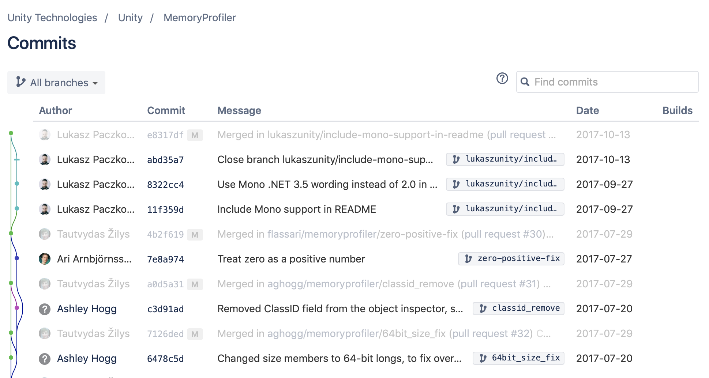
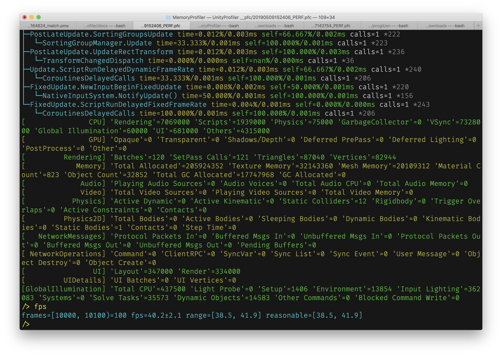
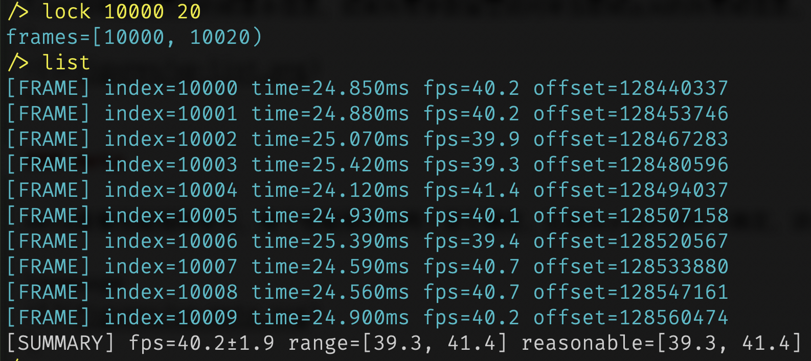
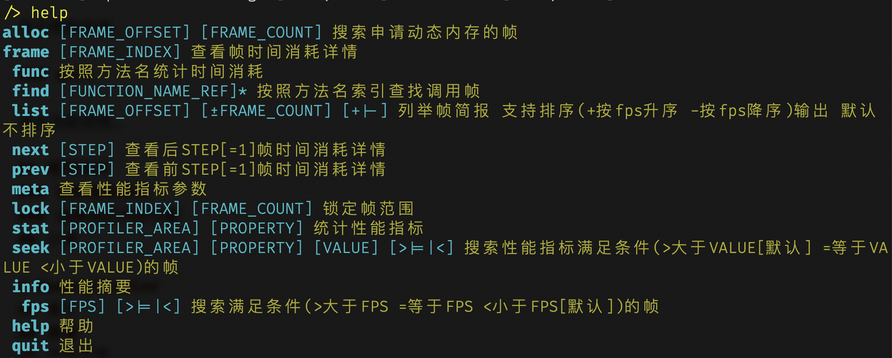
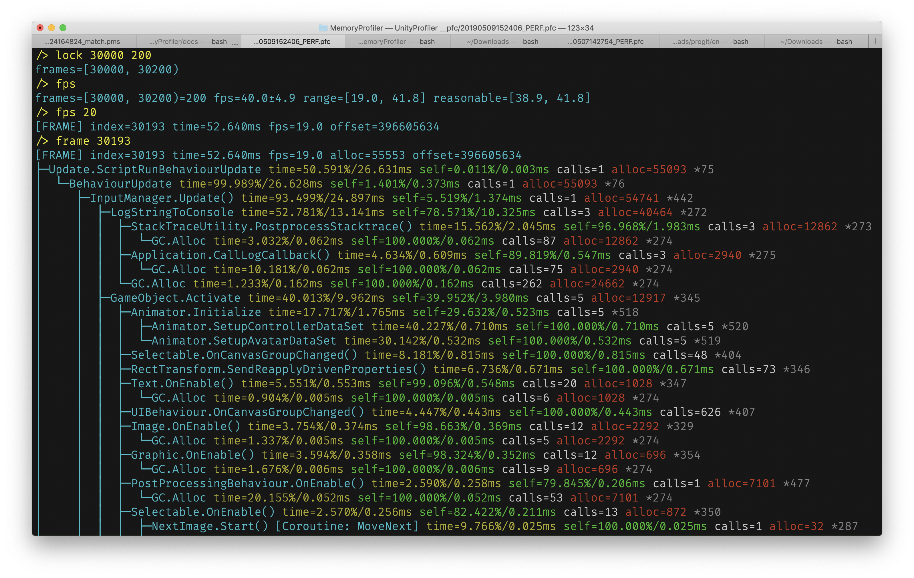

# 前言
*Unity*是个普及度很高拥有大量开发者的游戏开发引擎，其提供的*Unity*编辑器可以快速的开发移动设备游戏，并且通过编辑器扩展可以很容易开发出项目需要的辅助工具，但是*Unity*提供性能调试工具非常简陋，功能简单并且难以使用，如果项目出现性能问题，定位起来相当花时间，并且准确率很低，一定程度上靠运气。

> Profiler

目前Unity随包提供的只有*Profiler*工具，里面聚合*CPU*、*GPU*、内存、音频、视频、物理、网络等多个维度的性能数据，但是我们大部分情况下只是用它来定位卡顿问题，也就是主要*CPU*时间消耗(图\ref{profiler})。


在*CPU*的维度里面，可以看到当前渲染帧的函数调用层级关系，以及每个函数的时间开销以及调用次数等信息，但是这个工具同一时间只能处理**300**帧左右的数据，如果游戏帧率30，那么只能看到过去**10**秒的信息，并且需要我们一直盯着图表看才有机会发现意外的丢帧情况，这种设计非常的不友好，违反正常人的操作习惯，因为通常情况下如果我要调试游戏内战斗过程的性能开销，首先我要像普通玩家那样安安静静的玩一把，而不是分散出大部分精力去看一个只有10秒历史的滚动图表。这种交互带来两个明显的问题，

- 由于分心去看*Profiler*，导致不能全心投入游戏，从而不能收集正常战斗过程的性能数据
- 为了收集数据需要像正常玩家那样打游戏，不能全神关注*Profiler*图表，从而不能发现/查看所有的性能问题

上面两个情形相互排斥，鱼与熊掌不可兼得。从这个角度来看，*Profiler*不是一个好的性能调试工具，苛刻的操作条件导致我们很难发现性能问题，想要通过*Profiler*定位所有的性能问题简直是痴人说梦。

> MemoryProfiler

Unity还提供另外一个内存分析工具MemoryProfiler(图\ref{mp})


在这个界面的左边彩色区域里，*MemoryProfiler*按类型占用总内存大小绘制对应面积比例的矩阵图，第一次看到还是蛮酷炫的，*Unity*是想通过这个矩阵图向开发者提供对象内存检索入口，但是实际使用过程中问题多多。

- 内存分析过程缓慢
- 在众多无差别的小方格里面找到实际关心的资源很难，虽然可以放大缩小，但感觉并没有提升检索的便利性
- 每个对象只提供父级引用关系，无法看到完整的对象引用链，容易在跳转过程中迷失
- 引擎对象的引用和*IL2CPP*对象的引用混为一谈，让使用者对引用关系的理解模糊不清
- 没有按引擎对象内存和*IL2CPP*对象内存分类区别统计，加深使用者对内存使用的误解

*MemoryProfiler*[源码](https://bitbucket.org/Unity-Technologies/memoryprofiler)托管在*Bitbucket*，但是从最后提交记录来看，这个内存工具已经超过**2**年半没有任何更新了，但是这期间*Unity*可是发布了好多个版本，想想就有点后怕。
\
\

有热心开发者也忍受不了*Unity*这缓慢的更新节奏，干脆自己动手基于源码在[github](https://github.com/GameBuildingBlocks/PerfAssist)上更新优化，并更改了检索的交互方式。
\
\

不过这也只是在*MemoryProfiler*的基础上增加检索的便利性，跟理想的检索工具还有很大差距，虽然在内存的类别上做了相对*MemoryProfiler*更加清晰的区分，但是没有系统化的重构设计，内存分析过程依然异常缓慢，甚至会在分析过程中异常崩溃。
\

\

基于*Unity*性能调试工具现实存在问题，我开发了UnityProfiler和MemoryCrawler两款工具，分别替代*Profiler*以及*MemoryProfiler*进行相同领域的性能调试，这两个款均使用纯*C++*实现，因为经过与*C#*、*Python*对比后发现*C++*有绝对的计算优势，可以非常明显提升性能数据分析效率和稳定性。但是这两个款工具都没有可视化交互界面，不过并不影响分析结果的查看，它们都内置命令行模式的交互方式，并提供了丰富的命令，可以对性能数据做全方位的分析定位。


\newpage
# UnityProfiler

## 简介

UnityProfiler以*Unity*引擎自带的*Profiler*工具生成的性能数据为基础，提供多种维度的工具来帮助发现性能问题。该工具前期预研阶段使用*Python*测试逻辑，最终使用*C++*实现。由于是基于*Unity*的原生接口获取数据，所以需要保证*Profiler*工具打开后能看到性能采集界面，真机调试确保按照[官方文档](https://docs.unity3d.com/Manual/ProfilerWindow.html "Profiler Window")正确配置。
\

\

\

## 原理

*Unity*编辑器提供的*Profiler*调试工具，有多个维度的性能数据，我们比较常用的就是查看*CPU*维度的函数调用开销。这个数据可以通过*Unity*未公开的编辑器库
*UnityEditorInternal*来获取，鉴于未公开也谈不上查阅官方文档来获取性能数据采集细节，所以需要通过反编译查看源码才能知道其实现原理：构造类*UnityEditorInternal.ProfilerProperty*对象，调用*GetColumnAsSingle*方法来获取函数调用堆栈相关的性能数据。

```C#
var root = new ProfilerProperty();
root.SetRoot(frameIndex, ProfilerColumn.TotalTime, ProfilerViewType.Hierarchy);
root.onlyShowGPUSamples = false;

var drawCalls = root.GetColumnAsSingle(ProfilerColumn.DrawCalls);
samples.Add(sequence, new StackSample
{
    id = sequence,
    name = root.propertyName,
    callsCount = (int)root.GetColumnAsSingle(ProfilerColumn.Calls),
    gcAllocBytes = (int)root.GetColumnAsSingle(ProfilerColumn.GCMemory),
    totalTime = root.GetColumnAsSingle(ProfilerColumn.TotalTime),
    selfTime = root.GetColumnAsSingle(ProfilerColumn.SelfTime),
});
```

除了函数堆栈方面的开销，*Unity*还有渲染、物理、*UI*、网络等其他维度的数据，这些数据要通过另外一个接口来获取。

```C#
for (ProfilerArea area = 0; area < ProfilerArea.AreaCount; area++)
{
    var statistics = metadatas[(int)area];
    stream.Write((byte)area);
    for (var i = 0; i < statistics.Count; i++)
    {
        var maxValue = 0.0f;
        var identifier = statistics[i];
        ProfilerDriver.GetStatisticsValues(identifier, frameIndex, 1.0f, 
                                           provider, out maxValue);
        stream.Write(provider[0]);
    }
}
```

本工具基于以上接口把采集到的数据保存为*PFC*格式，该格式为自定义格式，使用了多种算法优化数据存储，比*Unity*编辑器录制的原始数据节省**80%**的存储空间，同时用*C++*语言编写多种维度的性能分析工具，可以高效率地定位卡顿问题。

## 命令手册
### alloc

**alloc** *[frame_offset][=0] [frame_count][=0]*

|参数|可选|描述|
|-|-|-|
|*frame_offset*|是|指定起始帧，相对于当前帧区间第一帧的整形偏移量|
|*frame_count*|是|指定帧数量|

alloc可以在指定的帧区间内搜索所有调用*GC.Alloc*分配内存的渲染帧。

    /> alloc 0 1000 
    [FRAME] index=2 time=23.970ms fps=41.7 alloc=10972 offset=12195
    [FRAME] index=124 time=25.770ms fps=38.8 alloc=184 offset=1326925
    [FRAME] index=127 time=24.870ms fps=40.2 alloc=10972 offset=1359192
    [FRAME] index=250 time=25.740ms fps=38.8 alloc=184 offset=2682771
    [FRAME] index=253 time=24.690ms fps=40.5 alloc=10972 offset=2715142


如果*frame_offset*和*frame_count*留空，alloc将所有可用帧作为参数进行条件搜索。

### info

无参数，查看当前性能录像的基本信息。

    frames=[1, 44611)=44610 elapse=(1557415446.004, 1557416582.579)=1136.574s 
    fps=39.9±12.8 range=[1.3, 240.6] reasonable=[27.2, 52.5]

### frame

**frame** *[frame_index] [stack_depth][=0]*

|参数|可选|描述|
|-|-|-|
|*frame_index*|**否**|指定帧序号|
|*stack_depth*|是|指定函数调用堆栈层级，默认完整堆栈|

frame可以查看指定渲染帧的详细函数调用堆栈信息，见下图。
\

\
在函数堆栈的底部，还有当前帧其他性能指标数据，主要有*CPU、GPU、Rendering、Memory、Audio、Video、Physics、Physics2D、NetworkMessages、NetworkOperations、UI、UIDetails、GlobalIllumination*等13类别，一共77个细分性能指标。
\

\
每次执行frame都会记录当前查询的帧序号，如果所有参数留空，则重复查看当前帧数据。

### next

**next** *[frame_offset][=1]*

|参数|可选|描述|
|-|-|-|
|*frame_offset*|是|相对当前帧的偏移|

next命令相当于按照指定帧偏移量修改当前帧序号同时调用frame命令生成帧数据。

### prev

**prev** *[frame_offset][=1]*

|参数|可选|描述|
|-|-|-|
|*frame_offset*|是|相对当前帧的偏移|

prev命令相当于按照指定帧偏移量修改当前帧序号同时调用frame命令生成帧数据。

### func

**func** *[rank][=0]*

|参数|可选|描述|
|-|-|-|
|*rank*|是|指定显示排行榜前*rank*个数据|

func在当前可用帧区间内，按照函数名统计每个函数的时间消耗，并按照从大到小的顺序排序，*rank*参数可以限定列举范围，默认列举所有函数的时间统计。

	/> func 1
	26.27%   1276.54ms #200     ██████████████████████████ WaitForTargetFPS *1
	/> func 5
	26.27%   1276.54ms #200     ██████████████████████████ WaitForTargetFPS *1
	 6.80%    330.49ms #200     ███████ Profiler.CollectMemoryAllocationStats *128
	 4.31%    209.44ms #1818    ████ RenderForward.RenderLoopJob *7
	 3.89%    188.95ms #909     ████ SceneCulling *25
	 3.11%    151.03ms #9071    ███ WaitForJobGroup *27

第一列表示函数时间消耗百分比，第二列表示时间消耗的总毫秒数，第三列表示函数调用的总次数，最后一列以\*开头的数字表示函数引用。

### find

**find** *[function_ref]*

|参数|可选|描述|
|-|-|-|
|*function_ref*|**否**|指定函数引用|

frame和func命令可以生成以\*开头的数字函数引用，find在当前帧区间内查找调用了指定函数的帧。
\

\

### list

**list** *[frame_offset][=0] [frame_count][=0]*

|参数|可选|描述|
|-|-|-|
|*frame_offset*|是|指定始帧，相对于当前帧区间第一帧的整形偏移量|
|*frame_count*|是|指定帧数量|

list列举指定范围的帧基本信息，如果所有参数留空则列举当前帧区间的所有帧信息。

    /> list 0 10
    [FRAME] index=20000 time=24.900ms fps=40.2 offset=261033153
    [FRAME] index=20001 time=25.230ms fps=39.6 offset=261046018
    [FRAME] index=20002 time=24.530ms fps=40.8 offset=261059203
    [FRAME] index=20003 time=24.840ms fps=40.2 offset=261072356
    [FRAME] index=20004 time=24.880ms fps=40.2 offset=261084797
    [FRAME] index=20005 time=24.900ms fps=40.2 offset=261097310
    [FRAME] index=20006 time=25.270ms fps=39.6 offset=261110143
    [FRAME] index=20007 time=24.470ms fps=40.9 offset=261122944
    [FRAME] index=20008 time=25.340ms fps=39.5 offset=261135865
    [FRAME] index=20009 time=24.400ms fps=41.0 offset=261148698
    [SUMMARY] fps=40.2±1.6 range=[39.5, 41.0] reasonable=[39.5, 41.0]

该工具同时在所有帧数据底部生成*fps*统计数据。

### meta

meta查看性能指标索引，包含*CPU、GPU、Rendering、Memory、Audio、Video、Physics、Physics2D、NetworkMessages、NetworkOperations、UI、UIDetails、GlobalIllumination*等13类别，以及类别属性一共77个细分性能指标，每个性能指标由类别和类别属性两个索引确定，比如*Scripts*由0-1确定，该命令用来为stat和seek提供输入参数。

\
{height=85%}
\

### lock

**lock** *[frame_index][=0] [frame_count][=0]*

|参数|可选|描述|
|-|-|-|
|*frame_index*|是|起始帧序号|
|*frame_count*|是|锁定相对于起始帧的帧数量|

lock参数留空恢复原始帧区间，一旦锁定帧区间，其他除info命令以外的其他命令均在该区间执行相关操作。
\

\

### stat

**stat** *[profiler_area] [property]*

|参数|可选|描述|
|-|-|-|
|*profiler_area*|**否**|类别索引，meta命令生成一级索引|
|*property*|**否**|类别属性索引，meta命令生成的二级索引|

stat在当前帧区间按照参数指标进行数学统计，给出99.87%置信区间的边界值，以及均值和标准差信息。

    /> stat 0 1
    [CPU][Scripts] mean=1874400.000±316545.565 range=[1582000, 2965000] 
    reasonable=[1582000, 2269000]

*range*表示当前帧区间*Scripts*时间消耗的最小值和最大值，单位是纳秒[1毫秒=1000000纳秒]，*reasonable*表示按照3倍标准差剔除极大值后的合理取值范围，超出该范围的值应该仔细检查，因为按照统计学在正态分布里面3倍标准差可以覆盖99.87%的数据。

### seek

**seek** *[profiler_area] [property] [value] [predicate][=>]*

|参数|可选|描述|
|-|-|-|
|*profiler_area*|**否**|类别索引，meta命令生成一级索引|
|*property*|**否**|类别属性索引，meta命令生成二级索引|
|*value*|**否**|临界值|
|*predicate*|是|>大于临界值、=等于临界值、<小于临界值三种参数|

seek按照参数确定的指标进行所搜比对，默认列举大于临界值的帧信息，可以通过*predicate*选择大于、等于和小于比对方式进行过滤帧数据。
 
    /> stat 0 1
    [CPU][Scripts] mean=1874400.000±316545.565 range=[1582000, 2965000] 
    reasonable=[1582000, 2269000]
    /> seek 0 1 2269000
    [FRAME] index=10012 time=23.880ms fps=41.9 offset=128599965

调用该命令前建议先用stat对性能指标进行简单数学统计，然后根据最大值或者最小值搜索可能存在性能问题的渲染帧。

### fps

**fps** *\[value] [predicate][=>]*


|参数|可选|描述|
|-|-|-|
|*value*|**否**|临界值|
|*predicate*|是|>大于临界值、=等于临界值、<小于临界值三种参数|

    /> fps
    frames=[20000, 20100)=100 fps=40.2±1.2 range=[39.2, 41.5] reasonable=[39.2, 41.2]
    /> fps 41.2 >
    [FRAME] index=20066 time=24.080ms fps=41.5 offset=261880027

当参数留空时，fps统计当前帧区间的帧率信息，指定临界值后，则默认过滤大于临界值的帧数据，可以通过*predicate*选择大于、等于和小于比对方式进行过滤帧数据。

### help

显示帮助信息。

\

\

### quit

退出当前进程。

## 使用案例

### 追踪渲染丢帧

\

\

1. 使用lock锁定大概帧区间[30000, 30000+200)
2. 使用无参数fps对当前帧区间生成针对*fps*统计数据
3. 从数值区间*range=[19.0, 41.8]*可以看出，有渲染帧的*fps*低于阈值20，调用`fps 20`把*fps*值低于20的所有帧列出来，从搜索结果可以看出第**30193**帧的*fps*等于19.0
4. 使用`frame 30193`查看目标帧的详细数据，可以发现当前帧有内存申请操作，并且*InputManager.Update()*函数占用了将近25毫秒的时间，其中*LogStringToConsole(打印日志)*和*GameObject.Activate*占用了大部分时间开销，可以查看更深层级进一步确定时间开销产生细节。

### 追踪动态内存分配

从上面的例子中可以发现动态内存申请会有比较大的时间开销，alloc命令可以快速在指定帧区间进行堆栈搜索，并把所有申请了动态内存的帧数据列出来，方便进一步定位内存产生细节。

\

\

1. 使用`alloc 0 100`列出当前帧区间子区间[0, 100)内有动态内存产生的渲染帧，可以看到*30055*帧产生了比较多的内存
2. 使用`frame 30055`查看目标帧的详细数据。


## 小结

UnityProfiler以巧妙的方式编码性能数据，节省80%的存储空间，内置多种命令以超高效率在不同维度帮助大家发现性能问题，并快速定位到产生问题的帧，使用该工具可以有效地帮助大家提升游戏质量。

\newpage
# MemoryCrawler
## 简介
## 原理
## 命令手册
### read
### load
### track
### str
### ref
### uref
### REF
### UREF
### kref
### ukref
### KREF
### UKREF
### link
### ulink
### show
### ushow
### find
### ufind
### type
### utype
### stat
### ustat
### list
### ulist
### bar
### ubar
### heap
### save
### uuid
### help
### quit

## 使用案例
### 检视内存对象
### 追踪内存增长
### 追踪内存泄漏
### 优化Mono内存

## 小结